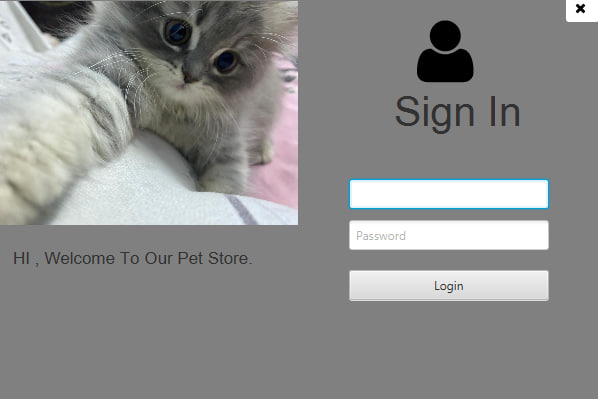

---

# PetStore

A simple pet store desktop application built using **JavaFX**.

## Features

- **Pet Listing:** View a comprehensive list of available pets, including their details such as name, breed, age, and price.
- **Add Pets:** Easily add new pets to the store with relevant information.
- **Edit Pet Details:** Modify the information of existing pets, including changing their names, breeds, and prices.
- **Delete Pets:** Remove pets from the inventory if they are no longer available.
- **Filter and Search:** Quickly find pets by applying filters for type (e.g., dog, cat), breed, age, and price range.
- **Sort Functionality:** Sort the pet list based on different criteria such as name, age, or price.
- **User-Friendly Interface:** Intuitive GUI designed for easy navigation and management of pet inventory.
- **Data Persistence:** Store pet information in a file or database, ensuring data is retained between application sessions.
- **Adoption Feature:** Allow users to adopt pets and manage their adoption status.
- **User Authentication:** Secure access to the application with a login feature for admin and staff roles.
- **Responsive Design:** Adaptable layout that works well on different screen sizes.
- **Help Section:** In-app help section providing users with guidance on how to use the application effectively.

## Technologies Used

- **JavaFX** for building the user interface.
- **Maven** or **Gradle** for dependency management.
- **MYSQL** or **H2 Database** for data persistence (if applicable).

## Screenshots

Here are some screenshots from the application:

  
  
   
  
  

## Contact

For any questions or concerns, feel free to reach out to:

- [Your Name](https://github.com/NorhanAbdelmonem)

Nor ^-_-^

---

Feel free to adjust the features list according to the specific capabilities of your application!
